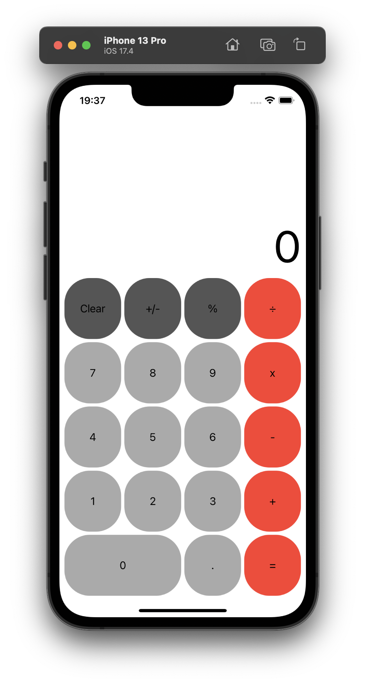

# Simple Calculator App

A basic calculator application developed to learn Swift and UIKit. This app performs basic arithmetic operations including addition, subtraction, multiplication, and division.

## Features

- Addition
- Subtraction
- Multiplication
- Division
- Clear input

## Screenshots



## Requirements

- iOS 16.0+
- Xcode 15.0+
- Swift 5.0+

## Installation

1. Clone the repository:
   ```bash
   git clone https://github.com/yourusername/simple-calculator.git
   ```
2. Open the project in Xcode:
   ```bash
   cd simple-calculator
   open SimpleCalculator.xcodeproj
   ```
3. Build and run the project on your simulator or device.

## Usage

1. Launch the app on your iOS device or simulator.
2. Use the keypad to input numbers.
3. Select the desired arithmetic operation (+, -, ×, ÷).
4. Press `=` to see the result.
5. Use `Clear` to clear the input and start a new calculation.

## Project Structure

- `SimpleCalculator.xcodeproj` - Xcode project file.
- `SimpleCalculator/` - Contains source files and resources.
  - `AppDelegate.swift` - App lifecycle management.
  - `ViewController.swift` - Main view controller with calculator logic.
  - `Main.storyboard` - UI layout designed using UIKit.

## Acknowledgements

- [Swift](https://swift.org) - The powerful programming language for iOS development.
- [UIKit](https://developer.apple.com/documentation/uikit) - Framework for constructing and managing the app's UI.

---

Happy Coding!
